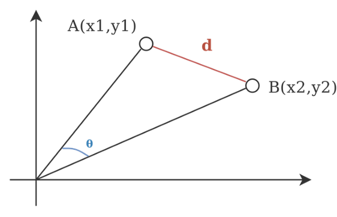
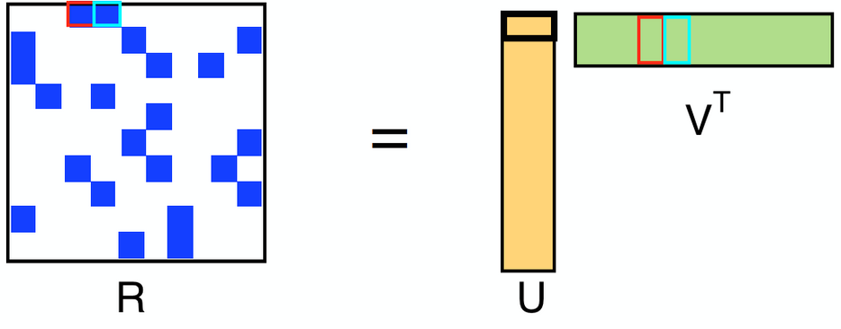
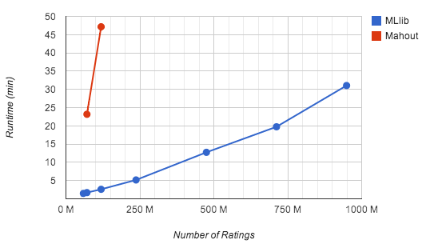

# Genre-based Collaborative Filtering for Movies Recommendation Systems

As more and more data is collected every day, we are moving from the age of information to the age of recommendation. One of the key reasons why we need recommendations in modern society, is that now people have too much options to choose from. This is possible due to the prevalence of the Internet. In the past, people used to shop in physical stores, the availability of options were limited and depended on the size of the stores, availability of products and marketing techniques. For instance, the number of movies that can be placed in a store depended on the size of that store. By contrast, nowadays, the Internet allows people to access abundant resources online. Netflix, for example, has a huge collection of movies. Although the amount of available information has increased, a new problem has arisen as people have a hard time selecting the items they actually want to see.

This project aims at implementing a different flavor of the well-known Item-based Collaborative Filtering (IBCF) typilically implied to develop recommender systems, which focuses solely on genre correlations among items, from which the name Genre-based Collaborative Filtering (GBCF). It is inspired by the method proposed by S. Choi, S. Ko, et al., A Movie Recommendation Algorithm Based on Genre Correlations, 2012, tailored to deisign a movies recommendation system on the [MovieLens dataset](https://grouplens.org/datasets/movielens/), avoiding any kind of influence from fluid sources, like user ratings. Indeed since genres are assumed to be assigned to movies by domain experts, we want to assert if they can provide good accuracy in terms of predictive power of the similarity model.

The advantages the GBCF approach brings are two-fold. On the one hand, it allows for a much faster training, as it does not have to learn from the millions of movies ratings, but rather from their latent aggregation in a _n_-by-_n_ genre correlations matrix **G**, where _n_ is the number of genres, which at worst is expected to be 3 to 4 orders of magnitude smaller than the number of movies ratings; on the other hand, it effectively solves the _cold start_ problem, that is, how to make quality predictions for users that, for instance, may have just subscribed to a streaming service. Indeed as many services ask the users about what the may or may not like beforehand, such an approach can intrinsecally estimate their favourite genres right away and produce somewhat reliable predictions from the get-go.

This project belongs to a larger project in conjunction with S. Bagnato, G. Losapio and M. Ghirardelli, whose goal was to compare different recommendation algorithms for movies recommendation systems on Spark, such as GBCF, cosine similarity IBCF and ALS, in terms of quality metrics and runtime. More specifically:
- Training time (min);
- RMSE of the movies ratings in [0, 5];
- Accuracy as the mean ratio of matchings between the Top 10 recommendend movies and the movies truly liked by each user at time _t_, where truly liked means with a rating geq than 3.

## Design choices

The GBCF algorithm has been implemented both locally in Python to analyze its validity in a trivial setting, and then later on in Scala in order to fully utilize the Spark engine on top of Hadoop distributed filesystem (HDFS) that has allowed the processing of the full MovieLens dataset.

- *Scala vs. Python*: The teacher of the [Spark course](https://learning.oreilly.com/videos/apache-spark-with/9781787129849/9781787129849-video4_7) on O'Reilly touches upon the movies IBCF problem suggesting an implementation in Scala, since in his experimentations it took **30 seconds** to run the **Scala** program, as opposed to the **15 minutes** it took with the same code written in **Python**.

- *Movies genres in IBCF*: The aforementioned teacher suggests to try and incorporate some kind of boosting reward to the similarity scores whenever movies belong to the same class of genres (i.e., the closer the genres, the higher the boost), as it should help preventing spurious correlations between movies from appearing in the end result.

## Folder structure

- `code` folder contains code related to the MovieLens dataset preprocessing, the GBCF module and a Jupyter notebook with GBCF local implementation;
- `data` folder contains the raw MovieLens dataset as well the preprocessed CSV files;
- `presentation` folder contains the presentation described above with compartive results on Spark;
- `resources` folder contains papers on IBCF.

## Recommendation systems
A recommender system refers to a system that is capable of predicting the future preference of a set of items for a user. It is a subclass of information filtering system that seeks to predict the rating or preference a user would give to a particular item. These systems are utilized enormously across multiple industries. Recommender systems are most commonly used as playlist generators for video and music services like Netflix, YouTube and Spotify, or product recommenders for services such as Amazon, or content recommenders for social media platforms such as Facebook and Twitter. A huge amount of research and wealth is invested by industries to find out techniques to get great recommendation and improve user experience.

Multiple researcher in different industries use multiple approaches to design their recommendation system. Traditionally, there are two methods to construct a recommender system:

- *Content-based filtering*
- *Collaborative filtering*

Content-based filtering analyses the nature of each item and aims to find the insights of the data to identify the user preferences. Further deatails are omitted since it is not relevant to the aim of the project.

### Content-based filtering
Content-based filtering methods are based on a description of the item and a profile of the user’s preferences. In a content-based recommender system, keywords are used to describe the items and a user profile is built to indicate the type of item this user likes. In other words, these algorithms try to recommend items that are similar to those that a user liked in the past (or is examining in the present). In particular, various candidate items are compared with items previously rated by the user and the best-matching items are recommended.

### Collaborative filtering
Collaborative filtering methods are based on collecting and analyzing a large amount of information on users’ behaviors, activities or preferences and predicting what users will like based on their similarity to other users. A key advantage of the collaborative filtering approach is that it does not rely on machine analyzable content and therefore it is capable of accurately recommending complex items such as movies without requiring an *understanding* of the item itself. Collaborative filtering is based on the assumption that people who agreed in the past will agree in the future, and that they will like similar kinds of items as they liked in the past.

It follows that if, for example, person *A* has the same opinion as person *B* on some item, then *A* is more likely to have *B*’s opinion on some other item. Mathematically speaking, assume there are ***n*** users and ***D*** items, we use a matrix ***M*** with size ***n*** x ***D***, known as `utility matrix`, to denote the past behavior of users. Each cell in the matrix represents the associated opinion that a user holds. For instance, ***M\[i, j]*** denotes how much user *i* likes item *j*. Collaborative filtering is approximately like filling the blank in the utility matrix that a user has not seen before based on the similarity between users or items. Two different variations of this algorithm do exist:
 1. *User-based*: Measure the similarity between target users and other users
 2. *Item-based*: Measure the similarity between the items that target users interact with and other items
 
### Hybrid filtering
Hybrid filtering, which is a combination of collaborative filtering and content-based filtering, as the name suggests, could be more effective in some cases. Hybrid approaches can be implemented in several ways:
- By making content-based and collaborative-based predictions separately and then combining them
- By adding content-based capabilities to a collaborative-based approach (and vice versa)
- By unifying the approaches into one mode.
 
 
### Explicit vs. implicit feedback
The standard approach to matrix factorization-based CF treats the entries in the utility matrix as *explicit preferences* given by the user on a given item (i.e., users giving ratings to movies).

It is common in many real-world scenarios to only have access to *implicit feedback* information (i.e., views, clicks, purchases, likes, shares, etc...). The approach to follow in this case changes quite a bit: instead of trying to model the matrix of ratings directly, it treats the data as numbers representing the strength in observations of user actions (i.e., the number of clicks, or the cumulative duration someone spent viewing a movie). Those numbers are then related to the level of confidence in observed user preferences, rather than explicit ratings given to items. The model then tries to find latent factors that can be used to predict the expected preference of a user for an item.
 
## Use case	
We proceed with the assumption that if a user *A* has watched movie *i* and rated it as good, then he/she with also like movies with similar ratings overall. But how do we measure similarity? *Cosine similarity* is a measure of similarity between two non-zero vectors of an inner product space that measures the cosine of the angle between them.

	
	<figcaption><b>Fig. 1 - Cosine similarity</b></figcaption>

 
 

Spark MLlib, on the other hand, implements a collaborative filtering algorithm called **Alternating Least Squares** (**ALS**), which has been implemented in many machine learning libraries and widely studied and used in both academia and industry. ALS models the rating matrix (***R***) as the multiplication of low-rank user (***U***) and product (***V***) factors, and learns these factors by minimizing the reconstruction error of the observed ratings. The unknown ratings can subsequently be computed by multiplying these predicted factors.

	
	<figcaption><b>Fig. 2 - Alternating least squares</b></figcaption>

 

ALS is an iterative algorithm. In each iteration, the algorithm alternatively fixes one factor matrix and solves for the other, and this process continues until it converges. MLlib features a blocked implementation of the ALS algorithm that leverages Spark’s efficient support for distributed, iterative computation. It uses native **LAPACK** to achieve high performance and scales to billions of ratings on commodity clusters, as Fig. 3 shows.

	
	<figcaption><b>Fig. 3 - ALS on Amazon reviews across 16 Spark nodes</b></figcaption>

